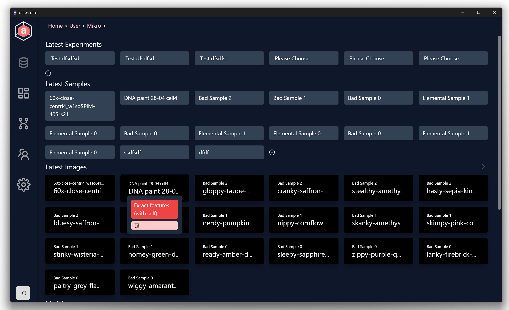
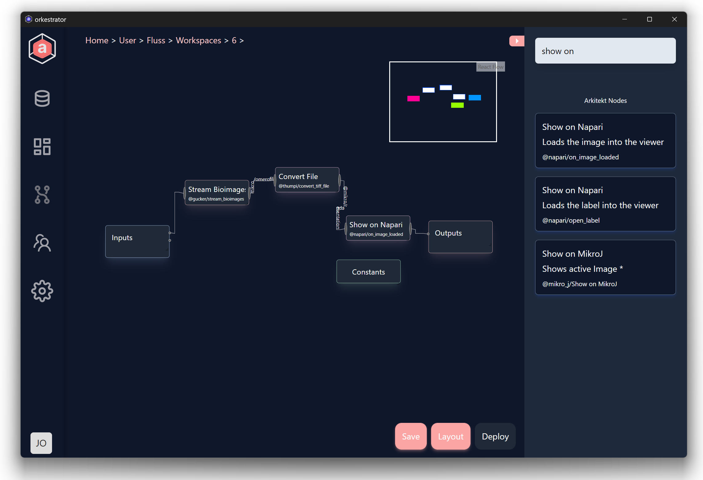

# Orkestrator

This repository includes the Orkestrator frontend for the arkitekt platform
it is used to build both the orkestrator web frontend as well as the orkestrator
application (build with tauri).

## Builds

Check our releases for the latest builds of the orkestrator application.

## Development

This repository comes with the website (src) and additional tauri bindings (src-tauri)
you can install both or just the website by running

`yarn`
and

`yarn dev`

to run the vite powered dev.

if you want to develop with tauri make sure to also install [tauri](https://tauri.app/)
To run the application mode run

`yarn tauri dev`

## Datainterface

## Workflows

